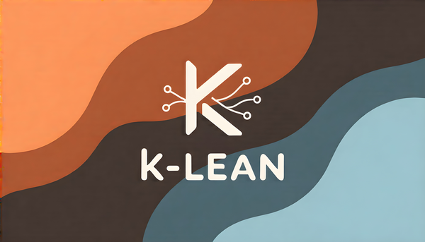

<p align="center">
  
</p>

<p align="center">
  <strong>Multi-Model Code Reviews & Persistent Knowledge for Claude Code</strong>
</p>

<p align="center">
  <a href="https://github.com/calinfaja/k-lean/actions"></a>
  <a href="CHANGELOG.md"></a>
  <a href="LICENSE"></a>
  <a href="https://python.org"></a>
</p>

---

## Why K-LEAN?

Claude Code is exceptional—but sometimes you need a **second opinion**.

When debugging goes circular, architecture decisions feel uncertain, or you want validation before merging—getting perspectives from **multiple top-tier models** breaks the loop and catches what a single model might miss.

K-LEAN gives you:
- **12 LLM models** for code reviews (DeepSeek, Qwen, GLM, Kimi, Minimax, Hermes)
- **Consensus scoring** showing which issues multiple models agree on
- **Persistent memory** that survives across sessions
- **8 specialist agents** for domain-specific analysis

All for **$15/month** via NanoGPT—or pay-per-use with OpenRouter.

---

## Quick Start

```bash
# Install
git clone https://github.com/calinfaja/k-lean.git
cd k-lean
pipx install .

# Setup
k-lean install                # Deploy to ~/.claude/
k-lean setup                  # Configure API (interactive)
k-lean doctor                 # Verify everything works
```

**In Claude Code:**
```bash
/kln:quick security           # Fast review (~30s)
/kln:multi "error handling"   # 3-5 model consensus (~60s)
/kln:agent security-auditor   # Specialist agent review (~2min)
```

---

## Features

### Multi-Model Reviews

Get **consensus** from 3-5 different LLMs on your code:

```bash
/kln:multi "review authentication flow"
```

**Output:**
```
GRADE: B+ | RISK: MEDIUM

HIGH CONFIDENCE (4/5 models agree):
  - auth.py:42 - SQL injection risk in user query
  - session.py:89 - Missing token expiration check

MEDIUM CONFIDENCE (2/5 models agree):
  - login.py:15 - Consider rate limiting
```

### Persistent Knowledge Database

Never lose insights. K-LEAN captures lessons and makes them searchable:

```bash
# Save knowledge from context (in Claude)
/kln:learn "JWT validation issue"    # Extracts insights from conversation

# Search later
FindKnowledge "JWT validation"
```

- **Context-aware capture** — `/kln:learn` extracts insights from conversation
- **Per-project isolation** — Each repo gets its own knowledge base
- **Semantic search** — Find by meaning, not just keywords
- **Auto-capture** — Git commits and reviews automatically logged

### 8 SmolKLN Specialist Agents

Domain experts powered by [smolagents](https://github.com/huggingface/smolagents):

| Agent | Expertise |
|-------|-----------|
| `code-reviewer` | OWASP Top 10, SOLID principles, code quality |
| `security-auditor` | Vulnerabilities, authentication, cryptography |
| `debugger` | Root cause analysis, systematic debugging |
| `performance-engineer` | Profiling, optimization, scalability |
| `rust-expert` | Ownership, lifetimes, unsafe code |
| `c-pro` | C99/C11, POSIX, memory management |
| `arm-cortex-expert` | Embedded ARM, real-time constraints |
| `orchestrator` | Multi-agent coordination |

**Agent Tools:** `read_file`, `search_files`, `grep`, `knowledge_search`, `get_complexity` (Python + C/C++ via lizard)

```bash
/kln:agent security-auditor "audit the payment module"
```

### Contrarian Debugging

When you're stuck, get **fresh perspectives**:

```bash
/kln:rethink
```

Uses 4 contrarian techniques:
1. **Inversion** — Look at NOT-X if others looked at X
2. **Assumption Challenge** — What if key assumption is wrong?
3. **Domain Shift** — What would a different expert see?
4. **Root Cause Reframe** — What if the symptom isn't the real problem?

---

## All Commands

| Command | Description | Time |
|---------|-------------|------|
| `/kln:quick <focus>` | Single model review | ~30s |
| `/kln:multi <focus>` | 3-5 model consensus | ~60s |
| `/kln:agent <role>` | Specialist agent with tools | ~2min |
| `/kln:rethink` | Contrarian debugging | ~20s |
| `/kln:doc <title>` | Generate session docs | ~30s |
| `/kln:remember` | End-of-session knowledge capture | ~20s |
| `/kln:status` | System health check | ~2s |
| `/kln:help` | Command reference | instant |

**Flags:** `--async` (background), `--models N` (count), `--output json|text`

---

## Architecture

```
┌──────────────────────────────────────────────────────────────────┐
│                        Claude Code                                │
│  ┌───────────────┐  ┌───────────────┐  ┌───────────────────────┐ │
│  │    Hooks      │  │   /kln:*      │  │   SmolKLN Agents      │ │
│  │ FindKnowledge │  │   Commands    │  │   8 Specialists       │ │
│  │ SaveInfo      │  │   (9 total)   │  │   + Tools             │ │
│  └───────┬───────┘  └───────┬───────┘  └───────────┬───────────┘ │
└──────────┼──────────────────┼──────────────────────┼─────────────┘
           │                  │                      │
           ▼                  ▼                      ▼
┌──────────────────────────────────────────────────────────────────┐
│                    LiteLLM Proxy (localhost:4000)                 │
│    qwen3-coder · deepseek-v3 · glm-4.6 · kimi-k2 · minimax-m2    │
│         deepseek-r1 · hermes-4 · llama-4-scout · ...             │
└──────────────────────────────────────────────────────────────────┘
           │                                         │
           ▼                                         ▼
┌─────────────────────────────┐    ┌────────────────────────────────┐
│      Knowledge DB           │    │    NanoGPT / OpenRouter        │
│  txtai semantic embeddings  │    │    12+ models available        │
│  .knowledge-db/ per project │    │    $15/mo or pay-per-use       │
└─────────────────────────────┘    └────────────────────────────────┘
```

---

## Hook Keywords

Type these directly in Claude Code:

| Keyword | Action |
|---------|--------|
| `FindKnowledge <query>` | Semantic search knowledge DB |
| `SaveInfo <url>` | Smart save URL with LLM evaluation |
| `asyncReview <focus>` | Background quick review |
| `asyncConsensus <focus>` | Background multi-model review |

**Note:** For context-aware knowledge capture, use `/kln:learn` (slash command).

---

## CLI Reference

```bash
# Core Setup
k-lean install          # Install components to ~/.claude/
k-lean setup            # Configure API provider (interactive)
k-lean uninstall        # Remove components from ~/.claude/

# Service Management
k-lean start            # Start LiteLLM proxy
k-lean start -s all     # Start LiteLLM + Knowledge server
k-lean start --telemetry # Also start Phoenix (agent tracing)
k-lean stop             # Stop all services

# Status & Diagnostics
k-lean status           # Show component status
k-lean doctor           # Diagnose configuration issues
k-lean doctor -f        # Auto-fix common issues
k-lean debug            # Live monitoring dashboard

# Models
k-lean models           # List available models
k-lean models --health  # Check model health (~60s)
k-lean test-model       # Test a specific model with quick prompt

# Reviews & Testing
k-lean multi "task"     # Multi-agent review (3 agents)
k-lean multi -t "task"  # Thorough review (4 agents)
k-lean test             # Run test suite (27 tests)

# Development & Info
k-lean sync             # Sync package data for PyPI
k-lean version          # Show K-LEAN version information
```

---

## Requirements

| Requirement | Version | Notes |
|-------------|---------|-------|
| Python | 3.9+ | `python3 --version` |
| Claude Code | 2.0+ | `claude --version` |
| pipx | any | `pipx --version` |
| API Key | - | NanoGPT ($15/mo) or OpenRouter |

---

## Why NanoGPT?

K-LEAN uses [NanoGPT](https://nano-gpt.com) as the default backend:

- **$15/month** — Unlimited access to most models
- **12+ models** — DeepSeek, Qwen, GLM, Kimi, Minimax, Hermes, Llama
- **Best open-source** — Often match or exceed GPT-4 on coding
- **Thinking models** — DeepSeek-R1, GLM-4.6-Thinking with reasoning chains

**Alternative:** [OpenRouter](https://openrouter.ai) (pay-per-use, 6 models configured)

---

## Compatibility

Works seamlessly with other Claude Code extensions:

| Tool | Integration |
|------|-------------|
| **[SuperClaude](https://github.com/SuperClaude-Org/SuperClaude)** | Use `/sc:*` and `/kln:*` together |
| **[Serena MCP](https://github.com/oraios/serena)** | Shared memory, enhanced code understanding |
| **Context7 MCP** | Documentation lookup during reviews |
| **Tavily MCP** | Web search for research |

---

## Documentation

| Document | Description |
|----------|-------------|
| [Installation](docs/installation.md) | Detailed setup guide |
| [Usage](docs/usage.md) | Commands, workflows, examples |
| [Reference](docs/reference.md) | Complete config reference |
| [System Overview](docs/architecture/OVERVIEW.md) | Architecture & design |
| [Components](docs/architecture/COMPONENTS.md) | Module breakdown |
| [Development](docs/architecture/DEVELOPMENT.md) | Contributing guide |

---

## Project Structure

```
k-lean/
├── src/klean/              # Main package
│   ├── cli.py              # CLI entry point
│   ├── smol/               # SmolKLN agent system
│   ├── knowledge/          # Knowledge DB integration
│   └── data/               # Installable assets
│       ├── scripts/        # 39 shell & Python scripts
│       ├── commands/kln/   # 9 slash commands
│       ├── hooks/          # 4 Claude Code hooks
│       ├── agents/         # 8 SmolKLN agent definitions
│       └── config/         # Configuration templates
├── docs/                   # User documentation
│   └── architecture/       # Technical documentation
├── tests/                  # Test suite
├── CLAUDE.md               # Claude Code instructions
└── AGENTS.md               # Universal AI instructions
```

---

## Contributing

Contributions welcome! See [CONTRIBUTING.md](CONTRIBUTING.md) for guidelines.

```bash
# Development install
git clone https://github.com/calinfaja/k-lean.git
cd k-lean
pipx install -e .           # Editable mode
k-lean install --dev        # Symlink instead of copy
k-lean test                 # Verify (27 tests)
```

---

## License

Apache 2.0 — See [LICENSE](LICENSE)

---

<p align="center">
  <b>Get second opinions on your code. Break the debugging loop.</b>
  <br><br>
  <i>Built for developers who want more perspectives.</i>
</p>
